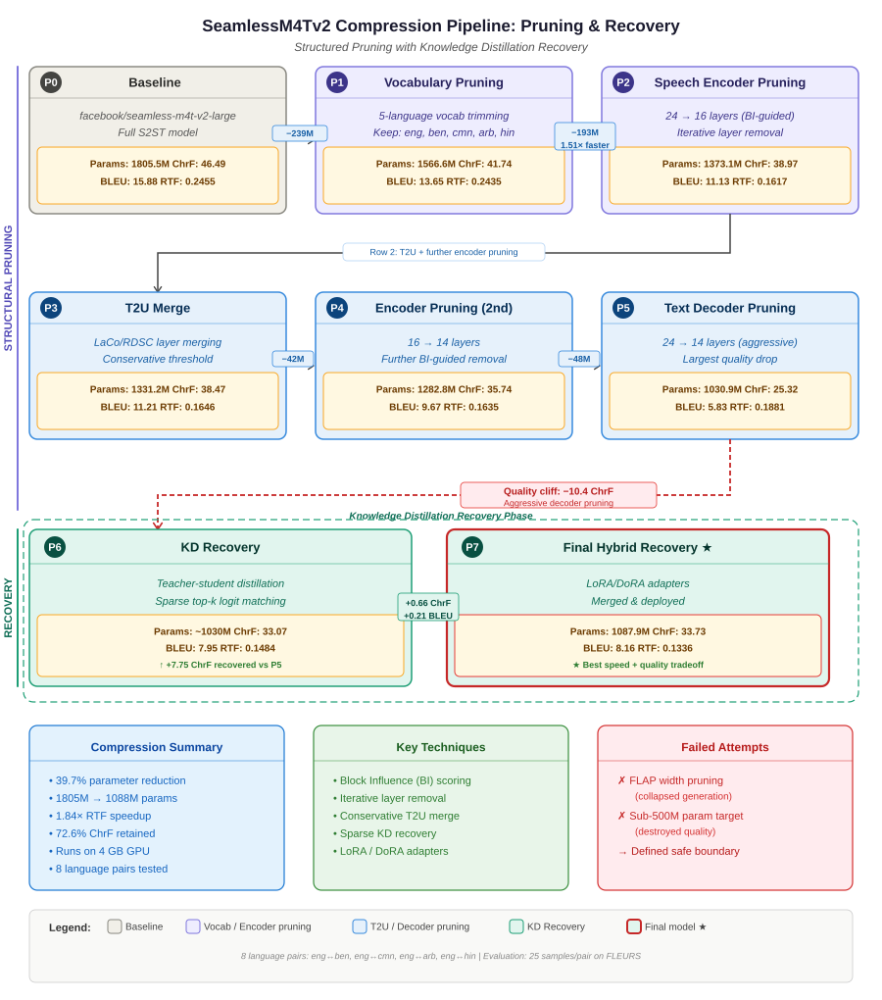

# Pruning SeamlessM4T

<div align="center">

**Structured Compression, Recovery, and Deployment of Meta SeamlessM4T v2**

*A CSE465 Machine Learning Project*

[](https://www.python.org/)
[](https://pytorch.org/)
[](https://huggingface.co/transformers/)
[](LICENSE)

</div>

---

## 📋 Table of Contents

- [Overview](#-overview)
- [Demo](#-demo)
- [Key Results](#-key-results)
- [Compression Pipeline](#-compression-pipeline)
- [Repository Structure](#-repository-structure)
- [Quick Start](#-quick-start)
  - [Local Inference](#local-inference)
  - [Duplex Web App](#duplex-web-app)
- [Technical Details](#-technical-details)
- [Research Methodology](#-research-methodology)
- [Known Limitations](#-known-limitations)
- [Citation & References](#-citation--references)
- [Contributors](#-contributors)

---

## 🎯 Overview

This repository contains a comprehensive semester-long research project that successfully compresses Meta's **SeamlessM4T v2 Large** model for multilingual speech-to-speech translation. The project demonstrates practical model compression techniques while maintaining usable translation quality across **five languages**: English, Bengali, Mandarin Chinese, Arabic, and Hindi.

### What We Achieved

- **39.7% parameter reduction** (1.805B → 1.088B parameters)
- **1.84× inference speedup** (RTF: 0.2455 → 0.1336)
- **Maintained 72.6% of baseline quality** (ChrF: 46.49 → 33.73)
- **Deployable on consumer hardware** (4GB VRAM - RTX 3050 Laptop GPU)
- **Working duplex web application** with real-time speech translation

This project explores the practical limits of structured pruning, demonstrates effective recovery strategies using knowledge distillation and parameter-efficient fine-tuning, and provides a complete deployment pipeline from research to production.

---

## 🎬 Demo

### Interactive Duplex Web Application


*Real-time bidirectional speech translation interface*

**📹 [Watch Full Demo Video](https://drive.google.com/file/d/1tNyAXy2Ia-zU1LS0ndL2GlhPdekxQ40t/view?usp=sharing)**

The duplex web application provides real-time speech-to-speech translation with:
- 🎤 Live microphone input with voice activity detection
- 🌐 Bidirectional translation between 5 languages
- 🔊 Synthesized speech output
- ⚡ Low-latency WebSocket streaming
- 💻 Runs on consumer-grade GPU (4GB VRAM)

---

## 📊 Key Results

### Compression Summary

| Metric | Baseline (P0) | Final Model (P7) | Change |
|--------|---------------|------------------|--------|
| **Parameters** | 1,805.5M | 1,087.9M | **-39.7%** ⬇️ |
| **ChrF Score** | 46.49 | 33.73 | -27.4% |
| **BLEU Score** | 15.88 | 8.16 | -48.6% |
| **RTF (Speed)** | 0.2455 | 0.1336 | **+1.84× faster** ⚡ |
| **VRAM Usage** | ~6.5 GB | ~2.1 GB | **-67.7%** 💾 |

**Key Takeaway:** The final model achieves significant compression and speedup while retaining over 72% of translation quality, making it deployable on consumer hardware.

### Evaluation Details

- **Language Pairs:** 8 bidirectional pairs (eng↔ben, eng↔cmn, eng↔arb, eng↔hin)
- **Test Set:** 25 samples per language pair from FLEURS dataset
- **Total Samples:** 200 speech-to-speech translations
- **Hardware:** NVIDIA GeForce RTX 3050 Laptop GPU (4.3 GB VRAM)

---

## 🔄 Compression Pipeline

The compression follows an 8-phase structured approach combining pruning and recovery techniques:


*Complete 8-phase compression and recovery pipeline*

### Phase-by-Phase Breakdown

```
📦 Pruning SeamlessM4T/
├── 📂 Final Notebooks/                    # ⭐ Start here
│   ├── v2 Multilingual full-final-notebook.ipynb
│   │   └── Main compression pipeline (P0-P5)
│   └── v2_2 Multilingual Finetuning Phase_6.ipynb
│       └── Recovery training (P6-P7: KD, LoRA, DoRA)
│
├── 📂 seamless_local/                     # Local inference setup
│   ├── seamless_local_inference.ipynb     # Tested on RTX 3050 (4GB)
│   └── local_working/models/              # Model artifacts location
│
├── 📂 duplexWebApp/                       # Production web application
│   ├── main.py                            # FastAPI server
│   ├── static/                            # Frontend (HTML/JS)
│   ├── models2/                           # Deployed model artifacts
│   ├── pruning_pipeline.svg               # Pipeline visualization
│   └── requirements.txt
│
├── 📂 mission500m/                        # Failed sub-500M attempt
│   └── Research evidence of compression limits
│
├── 📂 papers/                             # Reference papers
│   ├── SeamlessM4T original paper
│   ├── Block Influence (BI) pruning
│   ├── FLAP, Wanda, CULL-MT
│   └── Knowledge distillation papers
│
├── 📂 cluttered Experiments/              # Full experiment history
│   └── All intermediate notebooks, fixes, and notes
│
├── 📄 FINAL_REPORT.md                     # Comprehensive project report
├── 📄 REPRODUCIBLE_AGENT_PROMPT.md        # Reproduction instructions
└── 📄 README.md                           # This file
```

### Important Files

| Phase | Method | Params | ChrF | BLEU | RTF | Notes |
|-------|--------|-------:|-----:|-----:|----:|-------|
| **P0** | Baseline SeamlessM4T v2 | 1805.5M | 46.49 | 15.88 | 0.2455 | Full S2ST model |
| **P1** | Vocabulary Pruning | 1566.6M | 41.74 | 13.65 | 0.2435 | 5-language vocab trim |
| **P2** | Speech Encoder Pruning | 1373.1M | 38.97 | 11.13 | 0.1617 | 24→16 layers (BI-guided) |
| **P3** | T2U Layer Merge | 1331.2M | 38.47 | 11.21 | 0.1646 | LaCo/RDSC conservative |
| **P4** | Encoder Pruning (2nd) | 1282.8M | 35.74 | 9.67 | 0.1635 | 16→14 layers |
| **P5** | Text Decoder Pruning | 1030.9M | 25.32 | 5.83 | 0.1881 | 24→14 layers (aggressive) |
| **P6** | KD Recovery | ~1030M | 33.07 | 7.95 | 0.1484 | Teacher-student distillation |
| **P7** | Final Hybrid Recovery ⭐ | 1087.9M | 33.73 | 8.16 | 0.1336 | LoRA/DoRA adapters merged |

**Critical Insight:** Phase 5 (P5) represents a "quality cliff" with -10.4 ChrF drop, demonstrating the practical limit of aggressive text decoder pruning. Recovery phases (P6-P7) successfully restore +8.41 ChrF through knowledge distillation and parameter-efficient fine-tuning.

---

## 📁 Repository Structure

### Core Directories

| File | Purpose |
|------|---------|
| `Final Notebooks/v2 Multilingual full-final-notebook.ipynb` | **Main pipeline** - Phases P0-P5 (pruning) |
| `Final Notebooks/v2_2 Multilingual Finetuning Phase_6.ipynb` | **Recovery training** - Phases P6-P7 (KD, LoRA, DoRA) |
| `seamless_local/seamless_local_inference.ipynb` | **Local deployment** - Inference on consumer GPU |
| `duplexWebApp/main.py` | **Web server** - FastAPI + WebSocket backend |
| `FINAL_REPORT.md` | **Project report** - Complete methodology and results |
| `REPRODUCIBLE_AGENT_PROMPT.md` | **Reproduction guide** - Step-by-step instructions |

---

## 🚀 Quick Start

### Prerequisites

- Python 3.12+
- CUDA-capable GPU (minimum 4GB VRAM recommended)
- `uv` package manager (or `pip`/`conda`)

### Local Inference

Run the compressed model locally for speech-to-speech translation:

```powershell
# Navigate to local inference directory
cd seamless_local

# Create virtual environment
uv venv --python 3.12
.venv\Scripts\activate  # Windows
# source .venv/bin/activate  # Linux/Mac

# Install dependencies
uv pip install torch --torch-backend=auto
uv pip install transformers datasets accelerate peft librosa soundfile \
               sounddevice requests pandas sacrebleu evaluate sentencepiece \
               safetensors matplotlib seaborn notebook huggingface_hub

# Launch Jupyter
jupyter notebook seamless_local_inference.ipynb
```

**Expected Model Location:**
```
seamless_local/local_working/models/phase7_dora_merged_v1/
```

**Verified Hardware:**
- GPU: NVIDIA GeForce RTX 3050 Laptop GPU
- VRAM: 4.3 GB total, ~2.1 GB allocated after model load
- Performance: RTF 0.1336 (real-time capable)

### Duplex Web App

Launch the interactive web application for real-time translation:

```bash
# Navigate to web app directory
cd duplexWebApp

# Create virtual environment
python -m venv .venv
source .venv/bin/activate  # Linux/Mac
# .venv\Scripts\activate  # Windows

# Install dependencies
pip install -r requirements.txt

# Start server
./run.sh  # Linux/Mac
# python main.py  # Windows
```

**Access the app:**
```
http://localhost:8000
```

**Expected Model Layout:**
```
duplexWebApp/models2/phase7_final_merged/
duplexWebApp/models2/boundary_adapter.pt
```

**Features:**
- 🎤 Real-time microphone capture (16 kHz)
- 🔊 Voice activity detection (VAD)
- 🌐 WebSocket streaming
- 🗣️ Speech synthesis output
- 📊 Live translation metrics

---

## 🔬 Technical Details

### Compression Techniques

#### 1. **Vocabulary Pruning (P1)**
- Reduced vocabulary from 256k+ tokens to 5-language subset
- Languages: English, Bengali, Mandarin, Arabic, Hindi
- Savings: 239M parameters (-13.2%)

#### 2. **Block Influence (BI) Guided Layer Pruning (P2, P4)**
- Iterative layer removal based on BI scores
- Speech encoder: 24 → 16 → 14 layers
- Preserves critical layers for translation quality
- Savings: 193M + 48M parameters

#### 3. **Layer Merging (P3)**
- LaCo/RDSC conservative threshold merging
- Applied to Text-to-Unit (T2U) decoder
- Minimal quality impact (-0.5 ChrF)
- Savings: 42M parameters

#### 4. **Aggressive Text Decoder Pruning (P5)**
- Text decoder: 24 → 14 layers
- Largest single compression step
- Quality cliff: -10.4 ChrF (identified practical limit)
- Savings: 252M parameters

### Recovery Strategies

#### 5. **Knowledge Distillation (P6)**
- Teacher: Original SeamlessM4T v2 baseline
- Student: Pruned P5 model
- Sparse top-k logit matching
- Recovery: +7.75 ChrF

#### 6. **Parameter-Efficient Fine-Tuning (P7)**
- LoRA (Low-Rank Adaptation) adapters
- DoRA (Weight-Decomposed Low-Rank Adaptation)
- Merged adapters into base model
- Additional recovery: +0.66 ChrF
- Final speedup: 1.84× faster than baseline

### Architecture Modifications

```
SeamlessM4Tv2 Architecture (Compressed)
├── Speech Encoder: 14 layers (↓ from 24)
├── Text Encoder: 24 layers (unchanged)
├── Text Decoder: 14 layers (↓ from 24)
├── T2U Decoder: Merged layers (LaCo/RDSC)
├── Vocoder: Unit-to-waveform (unchanged)
└── Vocabulary: 5-language subset (↓ from 256k)
```

---

## 📚 Research Methodology

### Key Insights

1. **Vocabulary Pruning is Low-Risk**
   - Removes unused tokens for target language set
   - Minimal quality degradation (-4.75 ChrF)
   - Significant parameter savings (239M)

2. **Block Influence Identifies Redundant Layers**
   - BI scoring reveals layer importance
   - Iterative removal prevents catastrophic quality loss
   - Speech encoder more compressible than text decoder

3. **T2U Pruning Requires ASR-ChrF Metrics**
   - Text-only metrics cannot detect audio-path damage
   - ASR-ChrF essential for speech-to-speech evaluation
   - Conservative thresholds prevent vocoder collapse

4. **Text Decoder Pruning Has Hard Limits**
   - Aggressive pruning (24→14 layers) causes quality cliff
   - Sub-500M target proved infeasible
   - Defines practical compression boundary

5. **Recovery is Essential After Aggressive Pruning**
   - KD restores most lost quality (+7.75 ChrF)
   - LoRA/DoRA provide additional refinement (+0.66 ChrF)
   - Combined recovery: +8.41 ChrF (33% of loss recovered)

### Failed Experiments

| Approach | Reason for Failure | Learning |
|----------|-------------------|----------|
| **FLAP Width Pruning** | Collapsed generation, unintelligible output | Width pruning too destructive for S2ST |
| **Sub-500M Target** | Quality below usability threshold | Identified practical compression limit |
| **Aggressive T2U Merge** | Vocoder artifacts, distorted speech | Conservative thresholds necessary |
| **No Recovery Training** | Unacceptable quality degradation | Recovery phase mandatory |

### Evaluation Methodology

- **Dataset:** FLEURS (Few-shot Learning Evaluation of Universal Representations of Speech)
- **Sampling:** 25 samples per language pair (200 total)
- **Metrics:**
  - **ChrF:** Character n-gram F-score (primary metric)
  - **BLEU:** Bilingual Evaluation Understudy
  - **RTF:** Real-Time Factor (speed metric, lower is faster)
- **Hardware:** NVIDIA RTX 3050 Laptop GPU (4.3 GB VRAM)

---

## ⚠️ Known Limitations

1. **Model Artifacts Not Included**
   - Large model files (>1GB) not committed to repository
   - Users must train/download models separately
   - See notebooks for model generation instructions

2. **Limited Language Support**
   - Compressed for 5 languages only (eng, ben, cmn, arb, hin)
   - Original model supports 100+ languages
   - Vocabulary pruning removes other language capabilities

3. **Quality-Speed Tradeoff**
   - 27.4% ChrF degradation from baseline
   - Acceptable for resource-constrained deployment
   - Not suitable for production requiring baseline quality

4. **ONNX Conversion Incomplete**
   - Work-in-progress for edge deployment
   - Current deployment uses PyTorch models
   - See `v3_WIP_onnx-conversion.ipynb` for progress

5. **Hardware Requirements**
   - Minimum 4GB VRAM for inference
   - Training requires significantly more resources
   - CPU-only inference not optimized

---

## 📖 Citation & References

### This Project

If you use this work, please cite:

```bibtex
@misc{seamlessm4t_pruning_2026,
  title={Structured Compression and Recovery of SeamlessM4T v2},
  author={CSE465 Project Team},
  year={2026},
  institution={North South University},
  note={Available at: https://github.com/rayedriasat/Pruning-SeamlessM4T}
}
```

### Key References

This project builds upon the following research:

1. **SeamlessM4T** - Meta AI (2023)
   - Original multilingual speech translation model
   - [Paper](https://arxiv.org/abs/2308.11596)

2. **Block Influence (BI)** - Layer importance scoring
   - Guided structured pruning methodology
   - Used for encoder/decoder layer selection

3. **FLAP** - Fluctuation-based Adaptive Pruning
   - Attempted but failed for S2ST architecture
   - Informed width pruning limitations

4. **Wanda** - Pruning by Weights and Activations
   - Magnitude-based pruning baseline
   - Compared against BI approach

5. **CULL-MT** - Compression for Machine Translation
   - MT-specific compression strategies
   - Adapted for speech translation

6. **LoRA/DoRA** - Parameter-Efficient Fine-Tuning
   - Low-rank adaptation for recovery
   - Weight-decomposed variants

7. **Knowledge Distillation** - Hinton et al.
   - Teacher-student training framework
   - Sparse logit matching implementation

**Full bibliography available in:** `papers/` directory and `FINAL_REPORT.md`

---

## 👥 Contributors

**CSE465 Machine Learning Project**  
**North South University**  
**Semester: Spring 2026**

- **Team Members:** **Rayed Riasat Rabbi**, Md. Tanvir Chowdhury, Nazmus Sakib Nihal
- **Supervisor:** Dr. Nabeel Mohammed [NbM]

---

## 📄 License

This project is licensed under the MIT License - see the [LICENSE](LICENSE) file for details.

**Note:** The original SeamlessM4T model is subject to Meta's license terms. This repository contains only compression and deployment code, not the original model weights.

---

## 🙏 Acknowledgments

- Meta AI for the SeamlessM4T v2 model
- Hugging Face for Transformers library and model hosting
- NSU CSE Department for project support
- Research paper authors for compression methodologies

---

<div align="center">

**⭐ Star this repository if you find it useful!**

**📧 Questions? Open an issue or contact the team**

Made with ❤️ for advancing accessible multilingual speech translation

</div>

